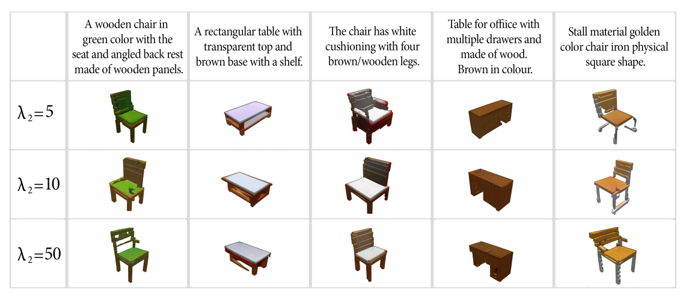

# AB-GAN: AdaBeleif Generative Adversarial Networks for Generating 3D Shapes from Natural Language Texts 
### Introducton

In this repo you can find the code for trainining and evaluating an AB-GAN model.
AB-GAN is a modified version of [DM-GAN](https://arxiv.org/abs/1904.01310). In this model, we substitute the Adam optimizer with the AdaBeleif optimizer, and then train our model using the ShapeNet dataset to generate 3D chairs and tabels based on natural language description.

### Data

Download the pre-processed ShapeNet dataset and extract it to `data/shapenet`

### Training
To train the model, run:
- `python main.py --cfg cfg/shapenet.yml --gpu 0`

### Validation
To validate the model, run:
- `python main.py --cfg cfg/eval_shapenet.yml --gpu 0`

### Performance
The following figure shows some 3D shapes which are generated using the AB-GAN model, with diffrent value for lambda2 hyperparameter: 

